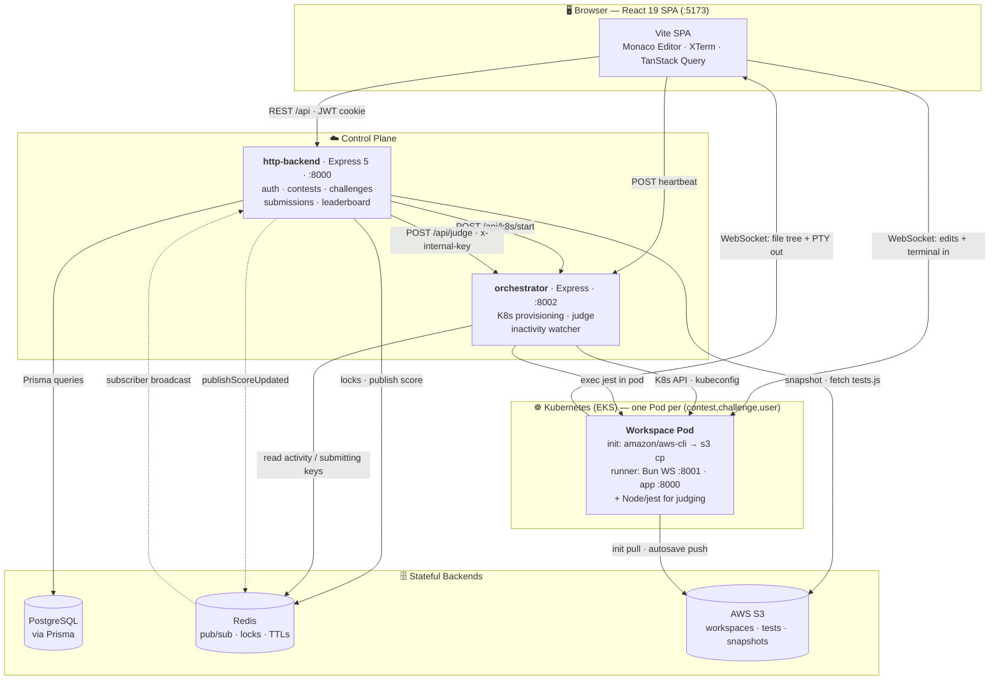
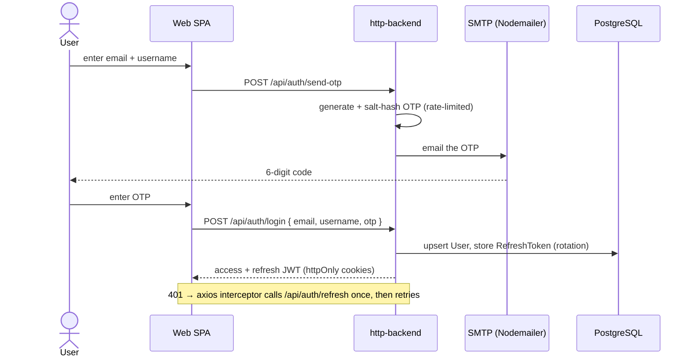
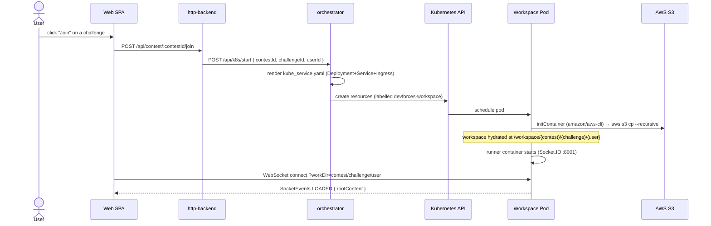
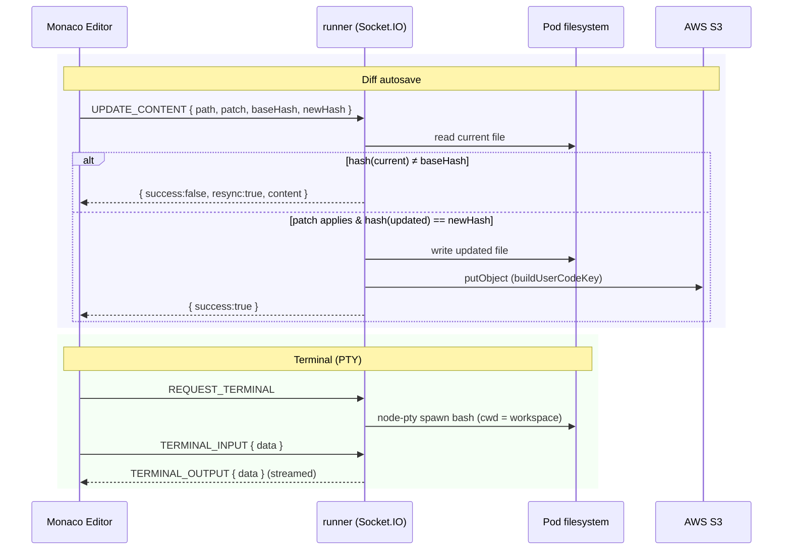
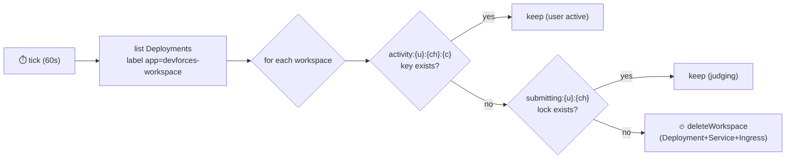
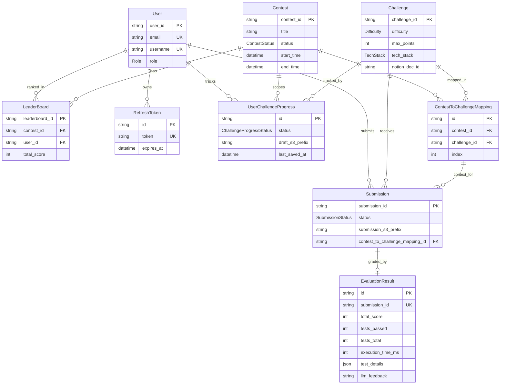

<div align="center">

# DevForces ⚔️

### A cloud-native competitive programming platform

*Join contests, solve coding challenges in a browser IDE, and get auto-judged in isolated Kubernetes pods — with a real-time, Redis-powered leaderboard.*


</div>

---

## 📑 Table of Contents

- [Overview](#-overview)
- [Key Features](#-key-features)
- [Tech Stack](#-tech-stack)
- [High-Level Design (HLD)](#-high-level-design-hld)
- [Core Workflows](#-core-workflows)
  - [Authentication (OTP → JWT)](#1-authentication-otp--jwt)
  - [Join a Contest → Provision Workspace](#2-join-a-contest--provision-a-workspace)
  - [Live Editing, Diff-Autosave & Terminal](#3-live-editing-diff-autosave--terminal)
  - [Submission & Judging](#4-submission--judging)
  - [Inactivity Reaper](#5-inactivity-reaper)
- [Low-Level Design (LLD)](#-low-level-design-lld)
  - [Monorepo Structure](#monorepo-structure)
  - [Service Responsibilities](#service-responsibilities)
  - [Shared Packages](#shared-packages)
  - [Design Patterns](#design-patterns)
  - [Runner WebSocket Protocol](#runner-websocket-protocol)
  - [Redis Key Reference](#redis-key-reference)
  - [The Judge Command](#the-judge-command)
- [Data Model](#-data-model)
- [API Reference](#-api-reference)
- [S3 Bucket Layout](#-s3-bucket-layout)
- [Getting Started](#-getting-started)
- [Building the Runner Image](#-building-the-runner-image)
- [Kubernetes / EKS Deployment](#-kubernetes--eks-deployment)
- [Configuration Reference](#-configuration-reference)
- [Troubleshooting](#-troubleshooting)
- [Roadmap](#-roadmap)
- [Contributing](#-contributing)
- [License](#-license)

---

## 🎯 Overview

**DevForces** is a competitive-programming platform where users join timed contests, solve coding
challenges in a fully browser-based IDE, and submit solutions that are executed and graded in
**ephemeral, isolated Kubernetes pods** provisioned on demand.

Unlike a classic "submit a function, get a verdict" judge, DevForces gives every participant a
**real cloud workspace**: a live file tree, a Monaco editor, and a streaming terminal (PTY) wired
straight into a container running their code. Solutions are graded by running a **Jest** test suite
inside that same pod, and scores propagate to a **real-time leaderboard** over Redis Pub/Sub.

The project is a **Bun + TurboRepo monorepo** of four services and a set of shared packages.

```
Browser IDE  ──REST──▶  http-backend  ──internal──▶  orchestrator  ──K8s API──▶  Workspace Pod
     │                       │                            │                          │
     └────WebSocket (files + terminal)───────────────────────────────────────────────┘
                             │                            │                          │
                          Postgres                      Redis  ◀──pub/sub──┐        S3
                          (Prisma)                  (locks/TTLs/leaderboard) │   (workspaces/tests)
```

---

## ✨ Key Features

| Area | Highlights |
|------|------------|
| 🧠 **Contests & Challenges** | Admin-authored contests, ordered challenge mappings, per-user progress tracking, difficulty & points |
| 💻 **Browser Cloud IDE** | Monaco editor, file tree, XTerm terminal streamed over WebSockets from a real pod PTY |
| ⚙️ **Ephemeral Execution** | One isolated K8s pod per `(contest, challenge, user)`, workspace hydrated from S3 by an init container |
| 🧪 **Auto-Judging** | Jest suite executed *inside* the user's pod via `kubectl exec`; per-test results, scoring, execution time |
| 🏆 **Real-Time Leaderboard** | Redis Pub/Sub broadcast so every participant sees rank changes live |
| 🔐 **OTP Auth + JWT** | Email OTP login, JWT access + rotating refresh tokens, revocation, rate limiting, RBAC |
| 💾 **Diff-Based Autosave** | Editor changes sync as patches (with hash integrity + resync) to the pod and back to S3 |
| ♻️ **Self-Healing Cost Control** | Background watcher reaps idle workspaces using Redis activity/lock keys |
| 🧱 **Monorepo DX** | TurboRepo orchestration, shared typed packages, Tsyringe DI, repository/service layering |

---

## 🚀 Tech Stack

| Layer | Technologies |
|-------|--------------|
| **Runtime / Tooling** | [Bun](https://bun.sh) `1.2.23` (package manager + runtime), [TurboRepo](https://turbo.build), TypeScript `5.9` |
| **Frontend** | React `19`, Vite `7`, TailwindCSS `4`, Radix UI / shadcn, TanStack Query, React Router `7`, Monaco Editor, XTerm, Socket.IO client, React Hook Form + Zod, Framer Motion |
| **API (`http-backend`)** | Express `5`, Tsyringe (DI), Zod, JWT (`jsonwebtoken`), Nodemailer, `express-rate-limit`, Morgan, Winston |
| **Orchestrator** | Express, `@kubernetes/client-node`, Tsyringe, ioredis |
| **Runner (in-pod)** | Bun, Socket.IO, `node-pty`, Node 20 + global `jest`/`supertest`/`express` (for judging) |
| **Database** | PostgreSQL + Prisma ORM |
| **Cache / Realtime** | Redis (`ioredis`) — Pub/Sub, distributed locks, activity TTLs |
| **Storage** | AWS S3 (`@aws-sdk/client-s3`) — workspace files, test suites, submission snapshots |
| **Infrastructure** | Docker (multi-stage), Kubernetes (AWS EKS), Nginx Ingress |

---

## 🏗️ High-Level Design (HLD)



### Component responsibilities

| Service | Port | Responsibility |
|---------|------|----------------|
| **web** | `5173` | React SPA: landing, auth, contest browser, contest detail, **Challenge IDE** (Monaco + terminal), profile |
| **http-backend** | `8000` | The public REST API. Owns auth, contests, challenges, submissions, scoring, leaderboard, and is the only writer to Postgres |
| **orchestrator** | `8002` | Privileged K8s controller. Creates/deletes workspace Deployments, runs the in-pod judge, serves the activity heartbeat, and reaps idle workspaces |
| **runner** | `8001` (+ `8000` app) | Runs **inside** each pod. Socket.IO server for file tree / file content / diff-autosave / terminal PTY. Port `8000` is reserved to preview the user's running app (e.g. their Express server) |

> **Why split http-backend and orchestrator?** The orchestrator holds privileged cluster
> credentials (kubeconfig) and is reachable only server-to-server (the `/api/judge` route is guarded
> by a shared `INTERNAL_API_KEY`). Keeping it separate from the internet-facing API limits blast radius.

---

## 🔄 Core Workflows

### 1. Authentication (OTP → JWT)



### 2. Join a Contest → Provision a Workspace



### 3. Live Editing, Diff-Autosave & Terminal

The pod's filesystem is the **source of truth**. Edits are sent as **patches** with `baseHash` and
`newHash`; the runner rejects stale patches and asks the client to **resync**, preventing silent
corruption. Saved files are mirrored to S3 so the workspace survives a pod restart.



### 4. Submission & Judging

This is the end-to-end grading pipeline. The `http-backend` orchestrates it; the actual test run
happens **inside the user's pod** via the orchestrator.

```mermaid
sequenceDiagram
    actor U as User
    participant W as Web SPA
    participant API as http-backend
    participant R as Redis
    participant S3 as AWS S3
    participant ORCH as orchestrator
    participant Pod as Workspace Pod
    participant DB as PostgreSQL

    U->>W: click "Submit"
    W->>API: POST /api/submit { contestId, challengeId }
    API->>R: SET submitting:{user}:{challenge} NX EX 180  (lock)
    API->>DB: create Submission (RUNNING)
    API->>S3: copy user workspace → submissions/{id}/ (snapshot)
    API->>S3: GET contests/.../tests.js
    API->>ORCH: POST /api/judge { ..., testsCode }  (x-internal-key)
    ORCH->>Pod: write tests.js, then exec:<br/>npx jest --testMatch "**/tests.js" --json --forceExit
    Pod-->>ORCH: stdout (Jest JSON) + stderr
    ORCH-->>API: { workspaceRunning, stdout, stderr }
    API->>API: parse JSON → testsPassed / total → score
    API->>DB: upsert EvaluationResult + status COMPLETED
    API->>R: publishScoreUpdated (Pub/Sub)
    R-->>API: subscriber broadcasts; API computes rank
    API->>R: DEL lock
    API-->>W: { score, tests[], leaderboard{ rank } }
```

> 💡 The `--testMatch "**/tests.js"` flag is load-bearing: the challenge test file is named
> `tests.js`, which Jest's *default* matcher (`*.test.js` / `*.spec.js` / `__tests__/**`) does **not**
> discover. See [Troubleshooting](#-troubleshooting).

### 5. Inactivity Reaper

Workspaces are expensive (1 vCPU / 1 GiB each), so the orchestrator runs a background watcher every
**60s** that destroys workspaces whose owner has gone idle — unless a submission is mid-flight.



The frontend pings `POST /api/contests/:c/challenges/:ch/heartbeat` while the IDE is open;
`activityMiddleware` refreshes the `activity:*` TTL on every heartbeat.

---

## 🧩 Low-Level Design (LLD)

### Monorepo Structure

```text
DevForces/
├── apps/
│   ├── web/                      # React 19 SPA (Vite, Tailwind 4, Monaco, XTerm)
│   │   └── src/
│   │       ├── features/         # auth · contest · challenge · leaderboard (api hooks + ui + types)
│   │       ├── components/       # editor (FileTree, SideBar), ui (shadcn), Output, ScoreGauge
│   │       ├── pages/            # Landing · Login · Verify · Contests · ContestDetail · ChallengeIDE · Profile
│   │       └── utils/            # axios-client (8000/8001/8002), file-manager
│   │
│   ├── http-backend/             # Express 5 REST API (:8000)
│   │   └── src/modules/          # auth · contest · challenge · submission · leaderboard
│   │       └── <module>/         #   route → controller → service → repository
│   │
│   ├── orchestrator/             # Kubernetes provisioner + judge (:8002)
│   │   ├── kube_service.yaml      #   Deployment/Service/Ingress template (placeholders)
│   │   └── src/modules/          # k8s · judge · activity · cleanup (inactivity watcher)
│   │
│   └── runner/                   # In-pod Socket.IO IDE backend (:8001)
│       └── src/modules/          # web-socket (event handlers) · pty (node-pty TerminalManager)
│
├── packages/
│   ├── store/                    # Prisma schema + generated client (PostgreSQL)
│   ├── common-types/             # Zod schemas, SocketEvents, hashContent/applyContentPatch
│   ├── auth-utils/               # JWT + OTP helpers
│   ├── s3/                       # AWS S3 wrapper (copyS3Folder, getS3Content, putS3Content, keys)
│   ├── file-service/             # pod filesystem ops (fetchDir, fetchFileContent, saveFile)
│   ├── logger/                   # Winston logger
│   ├── error-handler/            # Express error middleware, asyncHandler, validate, requestLogger
│   ├── ui/                       # Shared Radix/shadcn React components
│   ├── eslint-config/            # Shared ESLint config
│   └── typescript-config/        # Shared tsconfig bases
│
├── k8s/
│   ├── cluster-config.yaml        # eksctl cluster definition
│   └── ingress-controller.yaml    # Nginx ingress controller
│
├── Dockerfile.runner             # Multi-stage build for the runner image
├── turbo.json                    # TurboRepo task graph
└── package.json                  # Bun workspaces root
```

### Service Responsibilities

Each `http-backend` module follows a strict **route → controller → service → repository** chain:

- **route** — declares the HTTP path, attaches auth/validation/rate-limit middleware.
- **controller** — thin HTTP boundary; parses request, calls the service, shapes the response.
- **service** — business logic; orchestrates repositories, Redis, S3, the judge. *(No HTTP or SQL here.)*
- **repository** — the only place that touches Prisma.

This keeps the judging logic (`SubmissionService`) testable and decoupled from Express and Prisma.

### Shared Packages

| Package | Purpose | Notable exports |
|---------|---------|-----------------|
| `store` | Prisma client + schema | `prismaClient` (`store/client`) |
| `common-types` | Cross-service contracts | `SocketEvents`, `hashContent`, `applyContentPatch`, Zod schemas (`CreateContestSchema`, `SendOtpSchema`, …) |
| `auth-utils` | Token & OTP crypto | JWT sign/verify, OTP hashing |
| `s3` | S3 abstraction | `copyS3Folder`, `getS3Content`, `putS3Content`, `buildUserCodeKey` |
| `file-service` | In-pod FS | `fetchDir`, `fetchFileContent`, `saveFile` |
| `logger` | Structured logging | `logger` (Winston) |
| `error-handler` | Express middleware | `ErrorHandler.handle`, `asyncHandler`, `validate`, `requestLogger`, typed errors (`ValidationError`, `UnauthorizedError`) |
| `ui` | Design system | Radix/shadcn components |

### Design Patterns

- **Dependency Injection** — Tsyringe IoC container; services depend on interfaces (`IKubeService`, `ISubmissionRepository`, …) resolved at startup.
- **Repository + Service layering** — data access isolated from business logic (see above).
- **Distributed lock** — `SET submitting:{user}:{challenge} NX EX 180` makes submissions idempotent across concurrent clicks/instances.
- **Optimistic file sync** — content patches gated by `baseHash`/`newHash`, with a resync fallback.
- **Graceful shutdown** — both backends trap `SIGTERM`/`SIGINT`, drain the server, unsubscribe Redis, disconnect Prisma.
- **Multi-stage Docker** — `prune → install → runtime` to keep the runner image lean.

### Runner WebSocket Protocol

Socket.IO events (defined in `common-types` as `SocketEvents`). The client connects with
`?workDir=<contestId>/<challengeId>/<userId>`.

| Event | Direction | Payload | Purpose |
|-------|-----------|---------|---------|
| `LOADED` | server → client | `{ rootContent }` | Initial workspace file tree on connect |
| `FETCH_DIR` | client → server | `dir` → `{ success, data }` | Lazy-load a directory |
| `FETCH_CONTENT` | client → server | `filePath` → `{ success, data }` | Read a file |
| `SAVE_FILE` | client → server | `{ filePath, content }` | Full-content save (local + S3) |
| `UPDATE_CONTENT` | client → server | `{ path, patch, baseHash, newHash }` | Diff autosave with integrity guard |
| `REQUEST_TERMINAL` | client → server | — | Spawn a PTY (`bash`) in the workspace |
| `TERMINAL_INPUT` | client → server | `{ data }` | Keystrokes to the PTY |
| `TERMINAL_OUTPUT` | server → client | `{ data }` | Streamed PTY output |
| `TERMINAL_RESIZE` | client → server | `{ cols, rows }` | Resize the PTY |
| `TERMINAL_EXIT` | server → client | `{ exitCode }` | Shell exited |

> WS auth is **off by default** (`RUNNER_WS_AUTH=false`) because the browser connects cross-origin to
> the pod ingress and the backend cookie isn't sent. Enable it only if the client passes a token via
> `io(url, { auth: { token } })`.

### Redis Key Reference

| Key | Written by | TTL | Meaning |
|-----|-----------|-----|---------|
| `activity:{userId}:{challengeId}:{contestId}` | http-backend (heartbeat) | sliding | Workspace is in active use; reaper skips it |
| `submitting:{userId}:{challengeId}` | http-backend (submit) | 180s | Submission lock; reaper skips it & blocks double-submits |
| leaderboard channel | http-backend publisher → subscriber | — | Pub/Sub fan-out of score updates |

> ⚠️ The orchestrator and http-backend **must share the same Redis** (`>= 6.2`) — the reaper reads
> keys the API writes.

### The Judge Command

The orchestrator writes `tests.js` into the pod (via stdin, no shell interpolation), then runs:

```sh
cd /workspace/{contestId}/{challengeId}/{userId} \
  && (npx --no-install jest --version >/dev/null 2>&1 \
      || npm install --no-save jest supertest >/dev/null 2>&1); \
  npx jest --testMatch "**/tests.js" --json --forceExit --testTimeout=10000
```

- `--json` → machine-readable result on **stdout** (parsed by `SubmissionService`).
- `--testMatch "**/tests.js"` → discovers the file by name (default Jest matchers wouldn't).
- The runner image bundles Node 20 + global `jest`/`supertest`/`express` with `NODE_PATH` set, so the
  user's workspace needs **no `node_modules`** to be judged.

---

## 🗃️ Data Model



**Enums:** `Role` (USER/ADMIN) · `Difficulty` (EASY/MEDIUM/HARD) · `SubmissionStatus`
(PENDING/RUNNING/COMPLETED/FAILED) · `ContestStatus` (UPCOMING/ACTIVE/ENDED) ·
`ChallengeProgressStatus` (NOT_STARTED/IN_PROGRESS/SUBMITTED) · `TechStack` (NODEJS/PYTHON).

> A `Submission` with `contest_to_challenge_mapping_id = null` is a **practice** submission;
> a set value makes it a **contest** submission.

---

## 📡 API Reference

Base URL: `http://localhost:8000`. All `Protected` routes require the access-token cookie/header;
`ADMIN` routes additionally require the `ADMIN` role.

### Auth — `/api/auth`
| Method | Path | Access | Body |
|--------|------|--------|------|
| `POST` | `/send-otp` | Public (rate-limited) | `{ email, username }` |
| `POST` | `/login` | Public (rate-limited) | `{ email, username, role, otp }` |
| `POST` | `/refresh` | Public (refresh token) | cookie or `{ refresh_token }` |
| `POST` | `/logout` | Protected | — |
| `POST` | `/logout-all` | Protected | — |
| `GET`  | `/me` | Protected | — |

### Contests — `/api/contest`
| Method | Path | Access | Body |
|--------|------|--------|------|
| `GET` | `/` | Protected | — |
| `GET` | `/:contestId` | Protected | — |
| `POST` | `/` | ADMIN | `{ title, description, start_time, end_time, challenges? }` |
| `POST` | `/:contestId/join` | Protected | — (provisions the workspace) |
| `PATCH` | `/:contestId` | ADMIN | partial contest |
| `DELETE` | `/:contestId` | ADMIN | — |
| `DELETE` | `/:contestId/challenge/:challengeId` | ADMIN | — |

### Challenges — `/api/challenge`
| Method | Path | Access | Body |
|--------|------|--------|------|
| `GET` | `/` | ADMIN | — |
| `GET` | `/:id` | Protected | — |
| `GET` | `/contest/:contestId` | Protected | — |
| `POST` | `/` | ADMIN | `{ title, description, difficulty, notion_doc_id, max_points }` |
| `PATCH` | `/:id` | ADMIN | partial challenge |
| `DELETE` | `/:id` | ADMIN | — |

### Submissions — `/api/submit`
| Method | Path | Access | Body |
|--------|------|--------|------|
| `POST` | `/` | Protected | `{ contestId, challengeId }` |

### Leaderboard — `/api/leaderboard`
| Method | Path | Access | Notes |
|--------|------|--------|-------|
| `GET` | `/contests/:contestId?count=10` | Protected | Top N (default 10, max 100) |
| `GET` | `/contests/:contestId/me` | Protected | Caller's standing |

### Orchestrator (internal) — `:8002`
| Method | Path | Guard | Notes |
|--------|------|-------|-------|
| `POST` | `/api/k8s/start` | JWT | Provision a workspace `{ contestId, challengeId, userId }` |
| `POST` | `/api/judge` | `x-internal-key` | Server-to-server; runs Jest in the pod |
| `POST` | `/api/contests/:c/challenges/:ch/heartbeat` | JWT | Refresh workspace activity TTL |

---

## 🪣 S3 Bucket Layout

```text
s3://<S3_BUCKET_NAME>/
└── contests/{contestId}/challenges/{challengeId}/
    ├── tests.js                                  # the Jest suite (fetched by the judge)
    ├── users/{userId}/...                         # live workspace (init container pulls this)
    └── submissions/{submissionId}/...             # snapshot taken at submit time
```

Autosave writes go to `users/{userId}/...` via `buildUserCodeKey(workDir, filePath)`.

---

## 🛠️ Getting Started

### Prerequisites

| Requirement | Notes |
|-------------|-------|
| **Bun** `>= 1.2.23` | Package manager + runtime ([install](https://bun.sh)) |
| **PostgreSQL** | Local or hosted; connection string for `DATABASE_URL` |
| **Redis** `>= 6.2` | Same instance shared by http-backend + orchestrator |
| **AWS account** | S3 bucket + IAM keys (workspace files, tests, snapshots) |
| **SMTP credentials** | For OTP email (e.g. Gmail app password) |
| **Docker** | To build the runner image |
| **kubectl + a cluster** | *(Optional)* required only for live pod provisioning/judging (EKS or local kind/minikube) |

### 1. Clone & install

```bash
git clone https://github.com/ritik6559/DevForces.git
cd DevForces
bun install
```

### 2. Configure environment

Each service has a template. Copy and fill them in:

```bash
cp apps/http-backend/.env.example  apps/http-backend/.env
cp apps/orchestrator/.env.example  apps/orchestrator/.env
cp apps/runner/.env.example        apps/runner/.env
```

See the [Configuration Reference](#-configuration-reference) for what each variable does.
**Critical:** `ACCESS_TOKEN_SECRET`, `INTERNAL_API_KEY`, and `REDIS_URL` must match across the
services that share them.

### 3. Set up the database

```bash
cd packages/store
bunx prisma migrate dev      # create/apply migrations
bunx prisma generate         # generate the typed client
bunx prisma studio           # (optional) browse the DB
```

> The Prisma `datasource` reads `DATABASE_URL` from the environment — make sure it's exported (or in
> `packages/store/.env`) when running migrations.

### 4. Run everything in dev

From the repo root (TurboRepo runs all workspaces in watch mode):

```bash
bun run dev
```

Or run a single service from its directory:

```bash
cd apps/http-backend && bun run dev      # :8000
cd apps/orchestrator  && bun run dev      # :8002
cd apps/web           && bun run dev      # :5173
```

| Service | URL |
|---------|-----|
| Web (Vite) | http://localhost:5173 |
| http-backend | http://localhost:8000 (`/health`) |
| orchestrator | http://localhost:8002 (`/orchestrator/health`) |
| runner | http://localhost:8001 *(usually runs in-pod, not locally)* |

### Useful root commands

```bash
bun run build         # turbo build across all workspaces
bun run lint          # eslint across all workspaces
bun run check-types   # tsc --noEmit across all workspaces
bun run format        # prettier (.ts, .tsx, .md)
```

> ⚠️ There is currently **no automated test suite** in the repo.

---

## 🐳 Building the Runner Image

The runner image bundles Bun (the IDE backend) **and** Node 20 + global `jest`/`supertest`/`express`
(the judge). Rebuild and push it whenever `apps/runner` or the judge toolchain changes:

```bash
docker build -f Dockerfile.runner -t ritik6559/devforces-runner:<tag> .
docker push ritik6559/devforces-runner:<tag>
```

Then bump the image tag in [`apps/orchestrator/kube_service.yaml`](apps/orchestrator/kube_service.yaml)
(`containers[0].image`). **Use a fresh tag** rather than reusing one — nodes can serve a cached layer
for an unchanged tag.

---

## ☸️ Kubernetes / EKS Deployment

DevForces provisions one workspace per `(contest, challenge, user)` from a templated manifest.

```bash
# 1. Cluster (eksctl) — devforces-cluster, ap-south-1, 3× t3.medium, K8s 1.31
eksctl create cluster -f k8s/cluster-config.yaml

# 2. Nginx ingress controller
kubectl apply -f k8s/ingress-controller.yaml

# 3. AWS credentials the pods use to pull/push workspace files
kubectl create secret generic aws-credentials \
  --from-literal=AWS_ACCESS_KEY=...\
  --from-literal=AWS_SECRET_ACCESS_KEY=...\
  --from-literal=AWS_REGION=ap-south-1 \
  --from-literal=S3_BUCKET_NAME=devforces
```

**Per-workspace resources** (rendered from `kube_service.yaml` by the orchestrator at join time):

- **Deployment** — `initContainer` (`amazon/aws-cli`) hydrates `/workspace/...` from S3, then the
  `runner` container starts (1 vCPU / 1 GiB, 5 GiB ephemeral). Labelled `app=devforces-workspace`
  plus `devforces/{contest,challenge,user}-id` so the reaper can decode ownership.
- **Service** — exposes `8001` (WS/IDE) and `8000` (app preview).
- **Ingress** (nginx) — WebSocket-upgrade headers + `3600s` timeouts:
  - `<service>.devforces-out.ritik.fun` → `:8001`
  - `<service>.devforces-playground.ritik.fun` → `:8000`

---

## ⚙️ Configuration Reference

### Ports

| Service | Port |
|---------|------|
| web (Vite) | `5173` |
| http-backend | `8000` |
| runner (in-pod WS) | `8001` |
| orchestrator | `8002` |

### `http-backend/.env`
| Variable | Description |
|----------|-------------|
| `PORT` / `NODE_ENV` | Server port / environment |
| `ACCESS_TOKEN_SECRET` | JWT signing secret (**must match** orchestrator & runner-if-WS-auth) |
| `REFRESH_TOKEN_SECRET` | Refresh-token signing secret |
| `ACCESS_TOKEN_EXPIRY` / `REFRESH_TOKEN_EXPIRY` | e.g. `15m` / `7d` |
| `OTP_SALT` | Salt for hashing OTPs |
| `SMTP_HOST/PORT/SERVICE/USER/PASS` | Nodemailer SMTP for OTP email |
| `DATABASE_URL` | PostgreSQL connection string |
| `REDIS_URL` | Redis URL (**shared** with orchestrator) |
| `AWS_ACCESS_KEY` / `AWS_SECRET_ACCESS_KEY` / `AWS_REGION` / `S3_BUCKET_NAME` | S3 access |
| `ORCHESTRATOR_URL` | Base URL of the orchestrator (default `http://localhost:8002`) |
| `INTERNAL_API_KEY` | Shared secret for `/api/judge` (**must match** orchestrator) |

### `orchestrator/.env`
| Variable | Description |
|----------|-------------|
| `PORT` / `NODE_ENV` | Server port / environment |
| `ACCESS_TOKEN_SECRET` | Verifies the heartbeat JWT (**must match** http-backend) |
| `REDIS_URL` | **Same** Redis as http-backend (reads `activity:*`/`submitting:*`) |
| `INTERNAL_API_KEY` | Guards `/api/judge` (**must match** http-backend) |

> Kubernetes access uses the **default kubeconfig** (`KubeConfig.loadFromDefault()`), not env vars.

### `runner/.env` (for running the runner locally)
| Variable | Description |
|----------|-------------|
| `PORT` | WebSocket port (default `8001`) |
| `WORKSPACE_ROOT` | Workspace base path (default `/workspace`) |
| `CLIENT_URL` | Allowed browser origin for CORS |
| `RUNNER_WS_AUTH` | `true` to require a token in the WS handshake (default `false`) |
| `ACCESS_TOKEN_SECRET` | Only when `RUNNER_WS_AUTH=true` |
| `AWS_*` / `S3_BUCKET_NAME` | For diff-autosave uploads |

> **Frontend note:** the SPA currently hardcodes `http://localhost:8000/8001/8002` in
> `apps/web/src/utils/axios-client.ts`. Parameterize these (e.g. `VITE_*` env vars) before deploying
> the web app to a non-local environment.

---

## 🩺 Troubleshooting

**Submission shows "Failed to run · 0/0/0 · Jest could not run"**
The challenge test file is named `tests.js`, which Jest's default `testMatch` ignores
(`*.test.js` / `*.spec.js` / `__tests__/**` only). The judge must run with
`--testMatch "**/tests.js"` (a bare `npx jest tests.js` treats the name as a *path filter*, finds 0
tests, prints "No tests found" to stderr, and writes nothing to stdout). Confirm inside the pod:

```bash
kubectl exec <pod> -c runner -- /bin/sh -c \
  'cd /workspace/<c>/<ch>/<u> && npx jest --testMatch "**/tests.js" --json --forceExit'
```

**Tests pass but the API returns `500`**
Jest's `--json` nests each test under `assertionResults`, not `testResults` (that's the top-level
array of *suites*). Reading `suite.testResults.map(...)` throws `Cannot read properties of undefined`.
Parse `suite.assertionResults`.

**"Jest could not run" with no toolchain**
Verify the pod actually has the judge toolchain (it should, via the runner image):

```bash
kubectl exec <pod> -c runner -- /bin/sh -c 'which node; which npx; npx jest --version'
```

**Reaper deletes a workspace mid-use**
The frontend must POST the heartbeat while the IDE is open, and the orchestrator must point at the
**same Redis** as http-backend (`>= 6.2`).

**Windows `kubectl cp` fails with "one of src or dest must be a local file specification"**
`kubectl cp` parses the `C:` drive colon as a `pod:path` spec — use a **relative** destination path.

---

## 🗺️ Roadmap

- [ ] Multi-language judging (Python `TechStack` is modelled but the judge is Node/Jest-only today)
- [ ] Static-analysis scoring (`static_score` exists in the schema, currently `0`)
- [ ] LLM code review (`llm_feedback` column reserved)
- [ ] Hidden vs. public test cases
- [ ] Submission history UI
- [ ] Automated test suite + CI
- [ ] Parameterized frontend API base URLs

---

## 🤝 Contributing

1. Fork → create a feature branch (`git checkout -b feat/my-feature`)
2. `bun install`, make changes, keep it green: `bun run lint && bun run check-types`
3. Commit, push, and open a PR with a clear description.

Conventions: TypeScript everywhere, `route → controller → service → repository` for backend modules,
keep privileged K8s logic in the orchestrator, never log secrets.

---

## 📄 License

No license file is currently present in the repository. Until one is added, all rights are reserved
by the author. Add a `LICENSE` (e.g. MIT) to make contribution terms explicit.

---

<div align="center">

### ⚔️ Code. Compete. Conquer.

Built with Bun, React, Kubernetes, and a lot of Redis.

</div>
